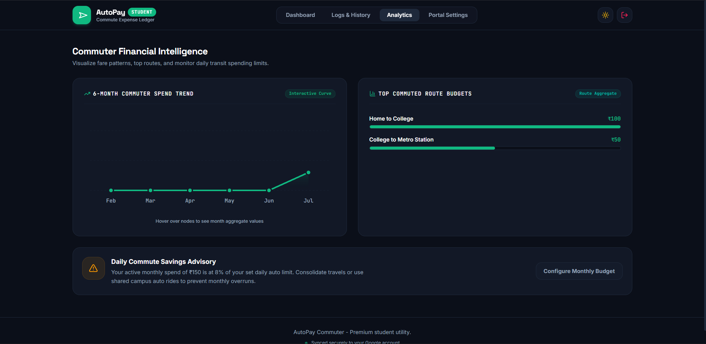
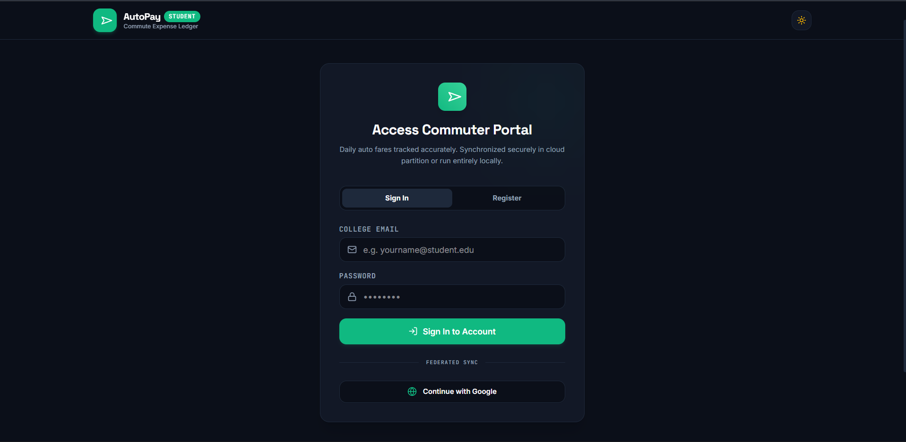
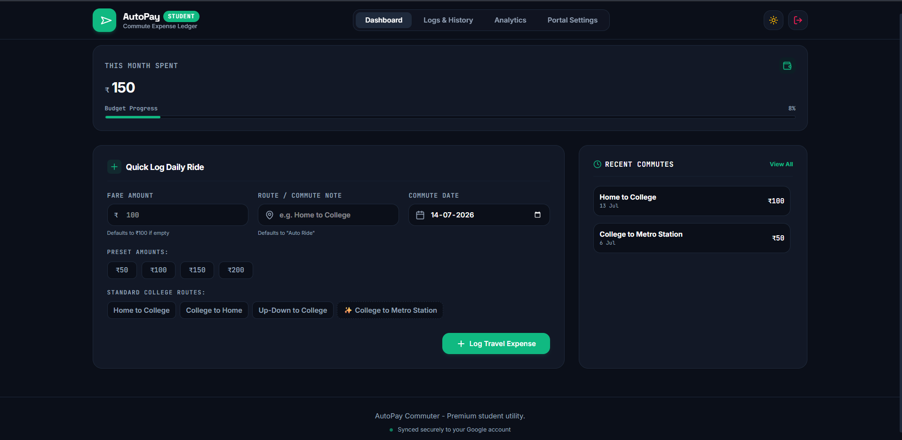
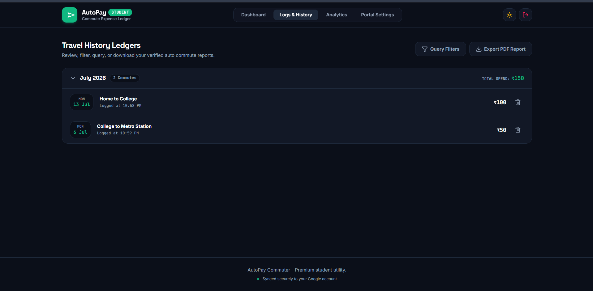

<div align="center">
  
  
  
  
  
  
  <h1 align="center">AutoPay</h1>
  
  <p align="center">
    A robust, responsive web application engineered to track daily auto commute expenses, featuring comprehensive analytics and secure cloud synchronization.
  </p>
  
  <p align="center">
    <strong><a href="https://autopay-37278.web.app/" target="_blank">View Live Application</a></strong>
  </p>
</div>

## Overview

The Daily Auto Expense Tracker is a professional-grade web application designed for meticulous tracking of commuting expenses. It integrates secure authentication, real-time database synchronization, and data visualization to provide users with actionable insights into their monthly budgets and daily expenditures.

## Screenshots









## Key Features

- **Secure Authentication:** Seamless user authentication via Email/Password or Google OAuth, managed by Firebase Auth.
- **Dashboard & Analytics:** Comprehensive visualization of daily and monthly auto expenses through interactive charts and data summaries.
- **Budget Management:** Proactive monthly budget configuration and real-time expenditure tracking.
- **Expense History & Filtering:** Advanced querying capabilities to filter logged trips by date range, amount, and specific routes.
- **Automated PDF Export:** One-click generation of formatted PDF reports detailing expense history.
- **Theme Configuration:** Native support for both dark and light modes, ensuring optimal accessibility and user preference.
- **AI Integration:** Enhanced analytical capabilities leveraging the Google GenAI SDK.
- **Responsive Architecture:** Fully responsive interface designed with Tailwind CSS, ensuring functional parity across desktop and mobile devices.

## Technology Stack

- **Frontend Framework:** [React 19](https://react.dev/) + [Vite](https://vitejs.dev/)
- **Language:** [TypeScript](https://www.typescriptlang.org/)
- **Styling:** [Tailwind CSS v4](https://tailwindcss.com/)
- **Animations:** [Motion (Framer Motion)](https://motion.dev/)
- **Icons:** [Lucide React](https://lucide.dev/)
- **Backend Infrastructure:** [Firebase](https://firebase.google.com/) (Authentication & Firestore Database)
- **Document Generation:** `jspdf` & `jspdf-autotable`
- **AI SDK:** `@google/genai`

## Getting Started

Follow the instructions below to configure and run the project in a local development environment.

### Prerequisites

- [Node.js](https://nodejs.org/) (v18 or higher recommended)
- A configured Firebase project with Authentication and Firestore enabled.

### 1. Installation

Clone the repository and install the required dependencies:

```bash
npm install
```

### 2. Environment Configuration

Copy the example environment configuration file:

```bash
cp .env.example .env.local
```

Update `.env.local` with your Gemini API key (if leveraging AI features) and your application URL:
```env
GEMINI_API_KEY="your_api_key_here"
APP_URL="http://localhost:3000"
```

Next, establish your Firebase client configuration. Open `firebase-applet-config.json` in the project root and provide your Firebase project credentials:

```json
{
  "apiKey": "YOUR_API_KEY",
  "authDomain": "your_project.firebaseapp.com",
  "projectId": "your_project_id",
  "storageBucket": "your_project.appspot.com",
  "messagingSenderId": "your_sender_id",
  "appId": "your_app_id"
}
```

### 3. Development Server

Initialize the Vite development server:

```bash
npm run dev
```

Navigate to [http://localhost:3000](http://localhost:3000) in your browser to access the application.

## Project Structure

```
daily-auto-expense-tracker/
├── public/               # Static assets
├── src/
│   ├── App.tsx           # Main application layout, routing, and state management
│   ├── dbService.ts      # Firebase Firestore operations (CRUD for expenses and budget)
│   ├── firebase.ts       # Firebase initialization and configuration logic
│   ├── types.ts          # TypeScript type definitions and interfaces
│   ├── index.css         # Global CSS and Tailwind configuration directives
│   └── main.tsx          # React application entry point
├── .env.example          # Environment variables template
├── firebase.json         # Firebase hosting and deployment configuration
├── firebase-applet-config.json # Firebase client configuration credentials
├── package.json          # Project metadata and dependency definitions
├── tsconfig.json         # TypeScript compiler configuration
└── vite.config.ts        # Vite build tool configuration
```

## Available Scripts

- `npm run dev` - Starts the local development server at `localhost:3000`
- `npm run build` - Compiles the application for production into the `dist` directory
- `npm run preview` - Locally previews the compiled production build
- `npm run lint` - Executes TypeScript type checking across the codebase

## Deployment

This project is configured for deployment via Firebase Hosting. To deploy the application to production, utilize the Firebase CLI.

1. **Authenticate the Firebase CLI:**
   ```bash
   firebase login
   ```

2. **Initialize Firebase (if not already configured):**
   ```bash
   firebase init
   ```
   *(Ensure you select the correct Firebase project and configure the public directory to `dist` if prompted.)*

3. **Build the Production Bundle:**
   ```bash
   npm run build
   ```

4. **Deploy to Firebase Hosting:**
   ```bash
   firebase deploy --only hosting
   ```

## Contributing

Contributions, issues, and feature requests are encouraged. Please consult the repository's issues page for current development tasks and guidelines.

## License

This project is licensed under the MIT License.
